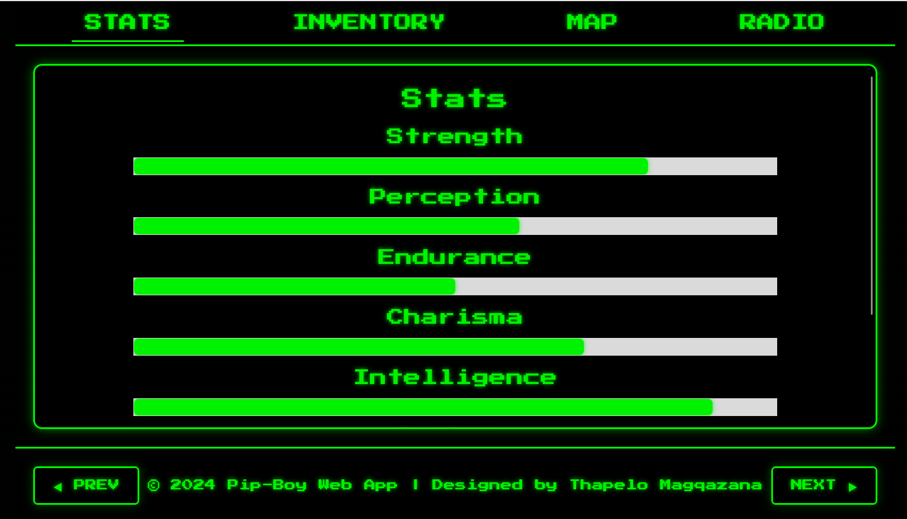

# Pip-Boy Web Application



A retro-inspired Pip-Boy web application designed to emulate Fallout's iconic interface. This project recreates the look and feel of the Pip-Boy with interactive features like stats, inventory management, and responsive navigation.

## Features

- **Stats Display**: Visualize character attributes with animated progress bars.
- **Inventory Management**: Scrollable and interactive item lists with detailed views.
- **Interactive Tabs**: Switch between Stats, Inventory, Map, and Radio.
- **Responsive Design**: Works seamlessly across desktops, tablets, and mobile devices.
- **Retro Styling**: Neon green CRT aesthetics with scanline effects and glowing UI elements.

---

## Demo

**Live Preview**: [Pip-Boy Web App](https://thapelomagqazana.github.io/pipboy-web-app/)

---

## Installation

1. **Clone the repository:**
   ```bash
   git clone https://github.com/thapelomagqazana/pipboy-web-app.git
   cd pipboy-web-app
   ```
2. **Open the project in your browser:**
   ```bash
   open index.html
   ```

---

## Technologies Used

- **HTML5**: Semantic structure and layout.
- **CSS3**: Styling, animations, and responsive design.
- **JavaScript (ES6)**: Interactive functionality and dynamic updates.

---

## **Project Structure**

pipboy-web-app/ 
├── assets/ # Icons, images, and other assets 
├── css/ # CSS stylesheets 
│ └── style.css 
├── js/ # JavaScript files 
│ └── app.js 
├── index.html # Main HTML file 
└── README.md # Project documentation

---

## **Contribution**

Contributions are welcome! Here's how you can help:

1. **Fork the repository.**
2. **Create a feature branch:**
   ```bash
   git checkout -b feature-name
   ```
3. **Commit your changes:**
    ```bash
    git commit -m "Description of changes"
    ```
4. **Push the branch:**
    ```bash
    git push origin feature-name
    ```
5. **Open a pull request.**

---

## **License**

This project is licensed under the MIT License. See the `LICENSE` file for more details.

---

## **Contact**

For any questions or feedback, reach out to me:

- **GitHub**: [thapelomagqazana](https://github.com/thapelomagqazana)
- **Email**: [tapsmcgzee8@gmail.com](mailto:tapsmcgzee8@gmail.com)
